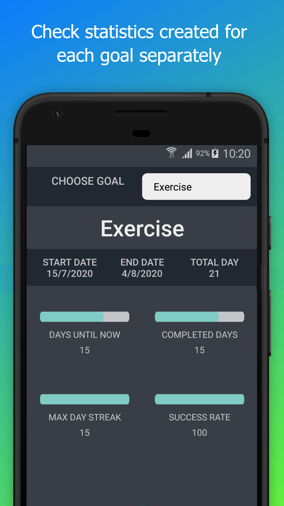
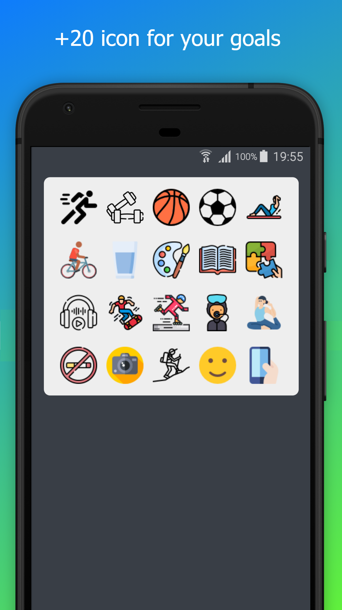

# HedefleVeBasar

Hedefle ve Basar - Habit and Goal Tracker:
-

Personal goal and habit calendar

Download:
-

Screenshots:
-

  
  
   
   

  
  
   
   

Features:
-

• Add unlimited goals

• Get calendar for your goals

• Mark your calendar

• See goals' statistics

• Multilanguage (English/Turkish)

• Add note and quote for your goals

• Reminder whenever you want

• No need internet connection

• FREE

Credit:
-
• [Pixel perfect](https://dribbble.com/iconsmind)

• [Freepik](https://www.facebook.com/Freepik)

• [Roundicons](https://twitter.com/flatroundicons)

• [xnimrodx](https://www.flaticon.com/authors/xnimrodx)

• [monkik](https://www.flaticon.com/authors/monkik)

• [ultimatearm](https://www.flaticon.com/authors/ultimatearm)

• [photo3idea studio](https://www.flaticon.com/authors/photo3idea-studio)

• [Smashicons](https://smashicons.com/)

• [mavadee](https://www.flaticon.com/authors/mavadee)

• [pause08](https://www.flaticon.com/authors/pause08)

Get in Touch:
-
If you want some help or want to give advice about the app etc. feel free to send a private email to me:

• alper.temel@ceng.deu.edu.tr

• alper.tml.14@hotmail.com

License:
-
HedefleVeBasar is distributed under the Apache License 2.0. See [LICENSE](https://github.com/alpertml/HedefleVeBasar/blob/master/LICENSE) for details.

